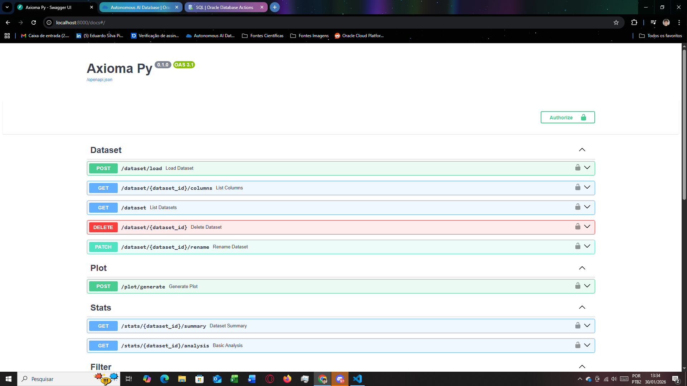
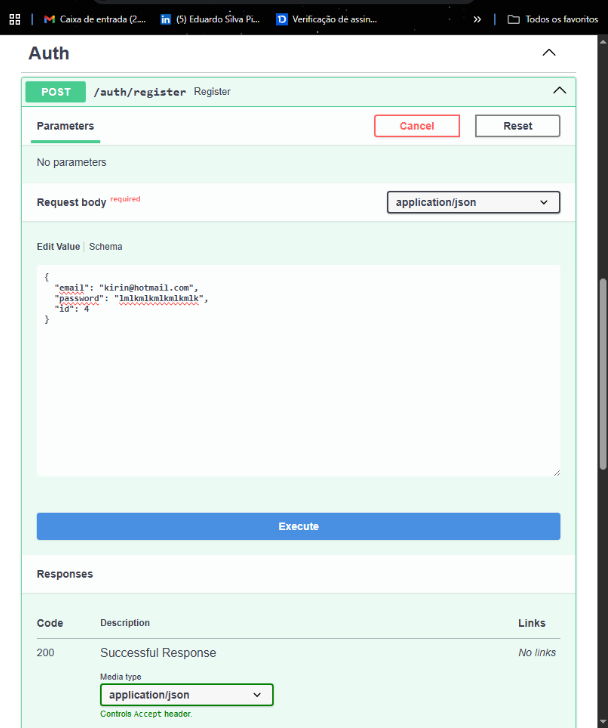

# **Axioma ERP Analítico**

Este sistema realiza análises gráficas a partir de conjuntos de dados nos formatos .csv e .json. O projeto foi desenvolvido com foco na aplicação de uma arquitetura profissional, visando consolidar boas práticas, decisões técnicas e experiência prática em desenvolvimento de software. A utilização e extensão da aplicação são livres, desde que os créditos de autoria original sejam mantidos para Eduardo S. P Teodoro.

## Visão Geral

O sistema permite:

- Analisar dados a partir de conjuntos locais em '.csv' e '.json'.

- Realizar filtragem e manupulação de datasets.

- Gerar estatísticas descritivas (média, minimo, máximo e afins), sumários e gráficos conforme os dados presentes.

- Exportar dados em formato '.csv'.

- Executar análises práticas como desempenho de equipes, análise de preços, comparação de tempo de uso etc. Tudo se baseando nos dados entregues.

- Rotas de API (endpoints) que permitem interagir com o sistema.

## **Stacks**

| **Tecnologia** | **Função** |
|:------------|:--------|
| FastAPI | Gerar API`s REST para o sistema |
| Python | Linguagem de Programação e Estrutura de Dados |
| Seaborn, Matplotlib e Pandas | Manipulção de dados e gráficos |
| Pytest | Testes Unitários e workflow automático para Github |
| SQLAlchemy | Camada ORM para abstração e genrenciamento dos dados |
| SQLite | Persistência local de dados (DB local) |
| Oracle OCI | Persistência de dados na nuvem (DB na nuvem) |
| Uvicorn e Gunicorn | Servidores locais para o sistema, Gunicorn específico para Container |
| Passlib, Bcrypt e Jose | Segurança e Autenticação via JWT (JSON Web Tokens) com verificação de Hash |
| Pydantic | Verificação de dados aplicados e para definição de esquemas (schemas) |
| HTTPX | Comunicação HTTP externa e assíncrona para as API`s |
| Docker | Isolar o sistema em container com ambiente próprio em uma VM (Linux Ubuntu 22.04 LTS) |

## *Arquitetura*

O Projeto foi dividido em várias pastas (camadas), cada uma com suas funções isoladas e utilizando uma das outras para que o sistema flua e funcione.

```bash
/Axioma_py
├──./github/workflows                # Testes em conjunto com o Githubs Actions
├──/api                              # Camada de rotas e endpoints para API REST
   ├──/dependencies                  # Dependencias de sistema para funcionamento das API`s
   ├──/routes                        # Rotas de API concisas com cada função do sistema
   └──/schemas                       # Esquemas para grenciamento e padronização dos dados
├──/application                      # Camdada de aplicação e Facade
   ├──/services                      # Inicialização das funções 
   └──/use_cases                     # Define os casos de uso do sistema como as funções interagem
├──/auth                             # Camada de segurança e autenticação (login, registro etc)
├──/config                           # Camada de configuração e dados importantes para o funcionamento
├──/core                             # Camada de lógica analítica do sistema, trata e retorna os dados
├──/data                             # Camada para armazenar dados exportados pelo sistema.
├──/infra                            # Camada de infrastrutura e verificação interna do sistema
   ├──/database                      # Sub-Camada com modelos ORM e repositórios de funções relevantes ao usuário
      ├──/models                     # Modelos ORM
      └──/repositories               # Repositórios de querys SQL do sistema
   └──/logging                       # Camada de logging para checar transito do sistema e verificar saúde
├──/interface                        # Camada para inclusão de Front-end UI (ainda vazia)
├──/tests                            # Camada de testes para garantir funcionamento e integridade dos endpoint, funções etc
├──/wallet                           # Credenciais necessárias para conexão mTLS com Oracle OCI (inclua sua wallet e configure para conectar ao seu DB da Oracle.)

```

## **Utilizar o Sistema**

1. Copie pelo Github utilizando git clone:
```bash
git clone -b dev --single-branch https://github.com/KiriinTeo/Axioma_Py
```

2. Crie .env
```text
ENV=development
DEBUG=true

SECRET_KEY=desenvolvimiento-secreto-speciall-key-super_especiale
DATABASE_URL=sqlite:///./dev.db

```
> Importante: este sistema tem pode se conectar á nuvem ou á um banco local, caso queira conectar com um banco na nuvem será necessário mudar este .env, que no momento indica o uso do SQLite em um ambiente de densenvolvimento, para caso queira conectar na Oracle em um ATP por exemplo, o .env seria assim:

```text
ENV=production
DEBUG=false

SECRET_KEY=chave-gerada-com-openssl-no-cmd
ALGORITHM=HS256

ORACLE_USER=seu-usuario-oracle
ORACLE_PASSWORD=a-senha-dele                             
ORACLE_DSN=o-serviço-que-quer         # (geramente: db_high, _low, _medium, _tpurgent. Encontrado no tnsnames.ora da sua Wallet baixada no Oracle OCI)

TNS_ADMIN=caminho-para-sua-wallet
WALLET_PASSWORD=senha-da-wallet       # você registra essa senha assim que for baixar sua instance ou regional wallet
```
> Para esse caso específico da Oracle você precisa baixar e descompactar sua wallet na pasta /wallet, o sistema possui um fallback para local caso a nuvem falhe, basta adicionar DATABASE_URL no .env production, mas ele atrapalha caso queira mesmo conectar somente na nuvem pois o sistema vai funcionar mesmo sem ela.

3. Instale as dependências:
```bash
pip install -r requirements.txt
```

4. Rode localmente:
```bash
uvicorn api.main:app --reload
```

> Caso queira rodar em um container, já existe Dockerfile e docker-compose para gerar com docker-engine em uma VM (recomendadeo e testado criar este container em um sistema operacional Linux Ubuntu 22.04 LTS) ai copie o sistema para a VM através do Git e rode lá com docker compose up --build

5. Uso das rotas:

Acesse o localhost, use o próprio endereço fornecido pelo Uvicorn ou coloque http://localhost:8000/docs no navegador (caso troque a porta 8000 em alguma parte do código, troque no endereço web também para acessar)

Após entrar nesta tela:


Vá até a rota "Register" e clique no botão "Try it Out" como indica a imagem:


Irá aparecer um campo JSON, insira o registro que quiser (ID precisa ser número) e clique em execute:


Tendo feito todo o registro, clique no botão branco e verde escrito "Authorize" com um cadeado ao lado, ele fica acima as rotas no canto superior direito delas. Aparecerá um pop-up do OAuth2 e nos campos email e password digite o email que registrou e a senha que registrou, não mexa nos campos "client_id" e "client_secret", mantenha "Client credential location" como 'Authorization header' também.

A partir disto você se cadastrou como usuário do sistema e pode utiliza-lo, as rotas vão indicar o que é preciso, você executa elas com o 'Try it Out' como já fez no registro, em muitas delas você vai utilizar do 'dataset_id' cujo é obtido depois de carregar uma fonte de dados .csv ou .json para o sistema com a rota '/load' por exemplo.
